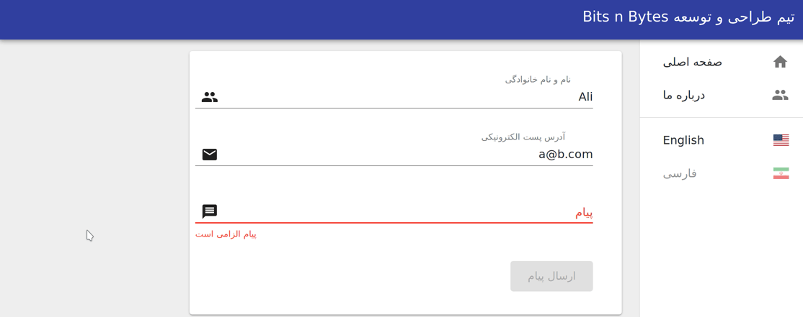

## Building Multilingual React Forms using react-intl, Formik and Yup

  <h2 lang="fa" dir="rtl" align="right">
    ساخت فرم چند زبانه در React از طریق react-intl, Formik و Yup
  </h2>  
  <h4 lang="fa" dir="rtl" align="right">
  در این اپ نحوه ساخت فرم های پویا و چند زبانه را از طریق کتابخانه های فورمیک react-intl، material-ui نمایش داده شده است. همچنین از کتابخانه Yup برای ارزیابی فیلد های ورودی کاربر استفاده شده است.
  </h4>

## Clone the project

### `git clone https://github.com/mjraadi/react-redux-formik-multilingual.git`

## Install the Dependencies

### `cd react-redux-formik-multilingual && npm install`

## Run the Project

In the project directory, run:

### `npm start`

Runs the app in the development mode. 
Open [http://localhost:3000](http://localhost:3000) to view it in the browser.

The page will reload if you make edits. 

This project was bootstrapped with [Create React App](https://github.com/facebook/create-react-app).
